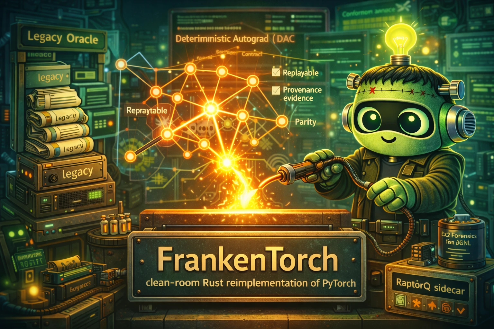

# FrankenTorch

  

FrankenTorch is a clean-room Rust reimplementation targeting grand-scope excellence: semantic fidelity, mathematical rigor, operational safety, and profile-proven performance.

## Absolute Parity Doctrine

FrankenTorch is not a partial rewrite. The target is a true drop-in replacement with complete feature and functionality overlap with upstream PyTorch observable behavior.

Non-negotiable rules:
- no permanent scope cuts accepted as a release condition
- no "minimal viable parity" acceptance standard
- sequencing is allowed only as temporary execution order, never as feature removal
- every temporary gap must map to explicit parity-closure beads plus conformance evidence

## What Makes This Project Special

Deterministic Autograd Contract (DAC): replayable gradient graph execution with provenance-complete gradient evidence.

This is treated as a core identity constraint, not a best-effort nice-to-have.

## Methodological DNA

This project uses four pervasive disciplines:

1. alien-artifact-coding for decision theory, confidence calibration, and explainability.
2. extreme-software-optimization for profile-first, proof-backed performance work.
3. RaptorQ-everywhere for self-healing durability of long-lived artifacts and state.
4. frankenlibc/frankenfs compatibility-security thinking: strict vs hardened mode separation, fail-closed compatibility gates, and explicit drift ledgers.

## Current State

- project charter docs established
- legacy oracle cloned:
  - /dp/frankentorch/legacy_pytorch_code/pytorch

## Delivery Sequencing (Not Scope Reduction)

Implementation proceeds in packetized waves (`FT-P2C-*`) to control risk and improve proof quality, but the terminal target remains complete PyTorch drop-in compatibility.

## Architecture Direction

tensor API -> dispatcher -> device kernels -> autograd engine -> nn and optimizer stack

## Compatibility and Security Stance

Preserve full PyTorch-observable tensor semantics, autograd contracts, optimizer behaviors, serialization contracts, and runtime compatibility invariants required for drop-in use.

Protect against gradient corruption, unsafe in-place mutation paths, and serialization mismatch or replay inconsistencies.

## Performance and Correctness Bar

Track step-time tails, backward overhead, kernel throughput, and memory churn under representative training traces.

Maintain deterministic gradient accumulation, alias/versioning rules, and backward-equivalence invariants.

## Key Documents

- AGENTS.md
- COMPREHENSIVE_SPEC_FOR_FRANKENTORCH_V1.md

## Conformance + E2E Forensics

- Run packet-side conformance:
  - `cargo test -p ft-conformance -- --nocapture`
- Versioned user workflow scenario corpus:
  - `artifacts/phase2c/USER_WORKFLOW_SCENARIO_CORPUS_V1.json`
- Scenario gap ledger (explicit non-covered branches + follow-up beads):
  - `artifacts/phase2c/USER_WORKFLOW_SCENARIO_GAP_LEDGER_V1.md`
- Unit/E2E/logging crosswalk (machine-diffable):
  - `artifacts/phase2c/UNIT_E2E_LOGGING_CROSSWALK_V1.json`
- Emit structured e2e forensic JSONL logs:
  - `cargo run -p ft-conformance --bin run_e2e_matrix -- --mode both --output artifacts/phase2c/e2e_forensics/e2e_matrix.jsonl`
- Emit full golden-journey matrix and derive coverage summary:
  - `cargo run -p ft-conformance --bin run_e2e_matrix -- --mode both --output artifacts/phase2c/e2e_forensics/e2e_matrix_full_v1.jsonl`
  - `jq -s '{schema_version:\"ft-user-journey-coverage-v1\", generated_on:\"2026-02-14\", source:\"artifacts/phase2c/e2e_forensics/e2e_matrix_full_v1.jsonl\", total_entries:length, total_failed: map(select(.outcome != \"pass\")) | length, suites:(map(.suite_id)|unique), packets:(map(.packet_id)|unique), reason_codes:(map(.reason_code)|unique), scenario_ids:(map(.scenario_id)|unique)}' artifacts/phase2c/e2e_forensics/e2e_matrix_full_v1.jsonl > artifacts/phase2c/e2e_forensics/golden_journey_coverage_v1.json`
- Packet-scoped e2e forensic slice:
  - `cargo run -p ft-conformance --bin run_e2e_matrix -- --mode both --packet FT-P2C-004 --output artifacts/phase2c/e2e_forensics/ft-p2c-004.jsonl`
- Triage failed forensic entries into replay-ready crash incidents:
  - `cargo run -p ft-conformance --bin triage_forensics_failures -- --input artifacts/phase2c/e2e_forensics/e2e_matrix.jsonl --output artifacts/phase2c/e2e_forensics/crash_triage_v1.json`
- Build failure forensics artifact index (unit/differential/e2e/perf/RaptorQ link map):
  - `cargo run -p ft-conformance --bin build_failure_forensics_index -- --e2e artifacts/phase2c/e2e_forensics/e2e_matrix_full_v1.jsonl --triage artifacts/phase2c/e2e_forensics/crash_triage_full_v1.json --output artifacts/phase2c/e2e_forensics/failure_forensics_index_v1.json`
- Run reliability budgets gate (coverage floors + flake budgets):
  - `cargo run -p ft-conformance --bin check_reliability_budgets -- --policy artifacts/phase2c/RELIABILITY_BUDGET_POLICY_V1.json --e2e artifacts/phase2c/e2e_forensics/e2e_matrix_full_v1.jsonl --output artifacts/phase2c/e2e_forensics/reliability_gate_report_v1.json`
- Run RaptorQ durability automation (sidecars + scrub + decode-event ledger):
  - `cargo run -p ft-conformance --bin run_raptorq_durability_pipeline`
  - outputs:
    - `artifacts/phase2c/RAPTORQ_REPAIR_SYMBOL_MANIFEST_V1.json`
    - `artifacts/phase2c/RAPTORQ_INTEGRITY_SCRUB_REPORT_V1.json`
    - `artifacts/phase2c/RAPTORQ_DECODE_PROOF_EVENTS_V1.json`
- Validate packet + global durability gates (includes RaptorQ global artifacts):
  - `cargo run -p ft-conformance --bin validate_phase2c_artifacts`
- Reliability policy + workflow contracts:
  - `artifacts/phase2c/RELIABILITY_BUDGET_POLICY_V1.json`
  - `artifacts/phase2c/RELIABILITY_GATE_WORKFLOW_V1.md`
- Failure envelope schema contract:
  - `artifacts/phase2c/FAILURE_FORENSICS_ENVELOPE_SCHEMA_V1.md`
- Log schema contract:
  - `artifacts/phase2c/TEST_LOG_CONTRACT_V1.md`

## Next Steps

1. Scaffold Cargo workspace and crate map.
2. Expand from the first shipped vertical slice through parity-closure packets until all intentional parity gaps are closed.
3. Establish differential conformance harness vs legacy oracle.
4. Record baseline benchmarks and wire regression gates.
5. Add RaptorQ sidecar durability for persistent evidence artifacts.

## Porting Artifact Set

- PLAN_TO_PORT_PYTORCH_TO_RUST.md
- EXISTING_PYTORCH_STRUCTURE.md
- PROPOSED_ARCHITECTURE.md
- FEATURE_PARITY.md

These four docs are now the canonical porting-to-rust workflow for this repo.
